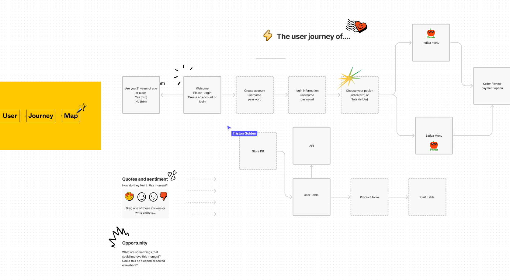

# Full_Stack_Store

A group project building our first full-stack application! A Full-Stack Storefront! We will design and build an app using the MVC paradigm, create your own server-side API, add user authentication, and connect to a database.

We will concieve and execute a design that solves a real-workd problem.  We will have a back end--with servers, database, APIs, and user authentication and an intuitive front end. We will continue to build on the agile development methodologies we have used throughout this course, like storing  project code in GitHub, managing work with a project management tool (Kanban), and implementing feature and bug fixes using the Git branch workflow and pull requests.

## Contributors: 
Akeia McCollum - [GitHub](https://github.com/DrMcCollum5)
David Smith    - [GitHub](https://github.com/DoodleBoops)
Mary Prince    - [GitHub](https://github.com/Cheez0id)
Triston Golden - [GitHub](https://github.com/TGolden95)

## Coding Requirements

>1. Must use Node.js and Express.js to create a RESTful API
>2. Must use Handlebars.js as the template engine
>3. Must use MySQL and the Sequelize ORM for the database
>4. Must have both GET and POST routes for retrieving and adding new data
>5. Must use at least one new library, package, or technology that we haven’t discussed
>6. Must have a folder structure that meets the MVC paradigm
>7. Must include authentication (express-session and cookies)
>8. Must protect API keys and sensitive information with environment variables
** Additional Requirements **
>9. Must be deployed using Heroku (with data)
>10. Must have a polished UI
>11. Must be responsive
>12. Must be interactive (i.e., accept and respond to user input)
>13. Must meet good-quality coding standards (file structure, best practices, etc.)
>14. Must have a professional README (unique name, description, link to the deployed app)

```
PSUDOCODE FROM JUNG
<!-- ALWAYS START WITH YOUR SERVER & YOUR DATABASE -->

0) Make sure you make a git repo, .gitignore, add .env to the .gitignore file, npm i, hide your personal information except give me your credit card info :^) 

1) Make our MODELS in the models folder that follow the architecture 
provided in the instructions

1a) Let's make sure my associations/relationships/one-to-one/one-to-many are set up properly. 
1b) index.js in the models folder!
1c) Within the models, let's make sure that the references are also set up correctly. Does your column refer to the correct table's ID? (foreign key)

2) Make sure that you check that the tables were created properly. (One way to check this is, when you run node seeds/index.js, do you get any errors?)
2a) If you want to drop your tables easily, in the server.js file, look for (force: false), change that to true IF YOU ARE LOOKING TO DROP THE TABLES. 
change it back to (force: false) IF YOU ARE KEEP THE TABLES. 

3) I would always check to make sure that the tables (model files) are being imported into the api routes files.
3a) I would use sequelize documentation to determine which METHODS I need to use for each route.
3b) If I were to do a get request of ALL the data, findAll(), findbyPK()
3c) If I need to return multiple datas from different tables, includes([]), you must make sure the relationships are set up first.
```


## Wireframe


